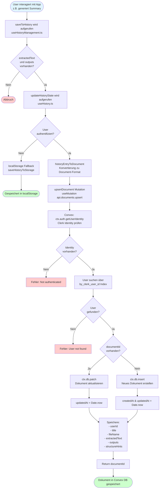

# Datenbank-Flowchart: Speichern und Laden von Dokumenten

## Flowchart: Speichern eines Eintrags in die Datenbank



## Flowchart: Laden eines Eintrags aus der Datenbank

```mermaid
flowchart TD
    Start([App startet oder<br/>User klickt auf History-Eintrag]) --> Init[useHistory Hook initialisiert]
    
    Init --> Query[useQuery api.documents.getAll<br/>Convex Query wird aufgerufen]
    
    Query --> ConvexAuth[Convex: ctx.auth.getUserIdentity<br/>Clerk Identity prüfen]
    ConvexAuth --> IdentityCheck{Identity<br/>vorhanden?}
    
    IdentityCheck -->|Nein| Empty1[Return: leeres Array]
    IdentityCheck -->|Ja| FindUser[User suchen über<br/>by_clerk_user_id Index]
    
    FindUser --> UserCheck{User<br/>gefunden?}
    UserCheck -->|Nein| Empty2[Return: leeres Array]
    UserCheck -->|Ja| QueryDocs[ctx.db.query 'documents'<br/>withIndex 'by_user_id'<br/>eq userId]
    
    QueryDocs --> Collect[collect alle Dokumente]
    Collect --> Sort[Sortiere nach updatedAt<br/>descending]
    
    Sort --> Convert[documentToHistoryEntry<br/>Konvertierung zu HistoryEntry-Format]
    
    Convert --> HistoryState[history State wird aktualisiert<br/>setHistory sortHistory entries]
    
    HistoryState --> LoadCheck{loadFromHistory<br/>aufgerufen?}
    
    LoadCheck -->|Nein| End1([History-Liste angezeigt])
    LoadCheck -->|Ja| Load[loadFromHistory wird aufgerufen<br/>useHistoryManagement.ts]
    
    Load --> SetState[State wird aktualisiert:<br/>- setFileName<br/>- setExtractedText<br/>- setOutputs<br/>- setStructureHints<br/>- setCurrentHistoryId]
    
    SetState --> ResetUI[UI wird zurückgesetzt:<br/>- setLoadedFromHistory true<br/>- setError ''<br/>- setSidebarOpen false<br/>- setIsEditing false<br/>- setMessages []<br/>- setInput '']
    
    ResetUI --> SelectTab[Ersten Tab auswählen<br/>setSelectedTabId]
    SelectTab --> End2([Dokument geladen und angezeigt])
    
    style Start fill:#e1f5ff
    style End1 fill:#ccffcc
    style End2 fill:#ccffcc
    style Empty1 fill:#fff4cc
    style Empty2 fill:#fff4cc
```

## Detaillierte Ablaufbeschreibung

### Speichern (Save Flow)

1. **Trigger**: User generiert z.B. ein Summary oder exportiert nach Notion
2. **useHistoryManagement.saveToHistory**: 
   - Prüft ob `extractedText` und `outputs` vorhanden sind
   - Erstellt/aktualisiert HistoryEntry mit Titel, fileName, outputs, etc.
   - Ruft `updateHistoryState` auf
3. **useHistory.updateHistoryState**:
   - Wenn User nicht authentifiziert: Fallback zu localStorage
   - Wenn User authentifiziert: Konvertiert HistoryEntry zu Document-Format
   - Ruft `upsertDocument` Mutation auf
4. **Convex Mutation `documents.upsert`**:
   - Authentifiziert User über Clerk Identity (`ctx.auth.getUserIdentity()`)
   - Findet User in `users` Tabelle über `by_clerk_user_id` Index
   - Wenn `documentId` vorhanden: `ctx.db.patch` (Update)
   - Wenn `documentId` fehlt: `ctx.db.insert` (Create)
   - Speichert: userId, title, fileName, extractedText, outputs, structureHints, timestamps

### Laden (Load Flow)

1. **Trigger**: App startet oder User klickt auf History-Eintrag
2. **useHistory Hook**:
   - Ruft `useQuery(api.documents.getAll)` auf
   - Wartet auf User-Authentifizierung
3. **Convex Query `documents.getAll`**:
   - Authentifiziert User über Clerk Identity
   - Findet User in `users` Tabelle
   - Lädt alle Dokumente des Users über `by_user_id` Index
   - Sortiert nach `updatedAt` (neueste zuerst)
4. **Konvertierung**:
   - `documentToHistoryEntry`: Konvertiert Convex Document zu HistoryEntry
   - Aktualisiert `history` State
5. **loadFromHistory** (wenn User auf Eintrag klickt):
   - Setzt alle State-Variablen (fileName, extractedText, outputs, etc.)
   - Resetet UI-State (editing, messages, etc.)
   - Wählt ersten Tab aus

## Datenstrukturen

### Convex Document Schema
```typescript
{
  _id: Id<"documents">,
  userId: Id<"users">,
  title: string,
  fileName: string,
  extractedText: string,
  outputs: Record<string, OutputEntry>,
  structureHints: string,
  createdAt: number,
  updatedAt: number,
  exportedSubject?: string,
  notionPageId?: string
}
```

### HistoryEntry Format
```typescript
{
  id: string,
  title: string,
  fileName: string,
  extractedText: string,
  outputs: Record<string, OutputEntry>,
  structureHints: string,
  createdAt: number,
  updatedAt: number,
  exportedSubject?: string,
  notionPageId?: string
}
```

## Authentifizierung

- **Clerk**: Frontend-Authentifizierung über `ClerkProvider`
- **Convex Auth**: Backend-Authentifizierung über `ctx.auth.getUserIdentity()`
- **User Lookup**: User wird über `clerkUserId` (aus Identity.subject) in `users` Tabelle gefunden
- **Fallback**: Nicht-authentifizierte User nutzen localStorage
